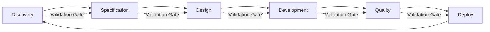

# AI-Assisted Product Development Framework

> A comprehensive, tool-agnostic framework for integrating UX research, technical specification, and AI-assisted development into a cohesive product development lifecycle.

[](CHANGELOG.md)
[](docs/status.md)
[](LICENSE)

## 🎯 Purpose

This framework bridges the gap between:
- **UX Research** → Validated user insights
- **Technical Specification** → Clear implementation requirements  
- **AI-Assisted Development** → Accelerated, high-quality code generation
- **Continuous Validation** → Evidence-based iteration

## 🏗️ Framework Architecture

```
┌─────────────────────────────────────────────────────────────────┐
│                    PRODUCT DEVELOPMENT LIFECYCLE                 │
├─────────────┬─────────────┬─────────────┬─────────────┬─────────┤
│  Discovery  │   Design    │ Development │   Quality   │ Deploy  │
│   & UX      │             │             │  Assurance  │         │
├─────────────┴─────────────┴─────────────┴─────────────┴─────────┤
│                         PROMPT LIBRARY                           │
├─────────────────────────────────────────────────────────────────┤
│                    AI TOOL ABSTRACTION LAYER                    │
├─────────────────────────────────────────────────────────────────┤
│                      VALIDATION FRAMEWORK                        │
└─────────────────────────────────────────────────────────────────┘
```

## 📂 Repository Structure

```
/
├── README.md                          # This file
├── docs/
│   ├── README.md                      # Framework documentation
│   ├── prd.md                         # Product Requirements Document
│   └── adrs/                          # Architecture Decision Records
│       ├── 0001-prompt-frontmatter-schema.md
│       └── 0002-mcp-prompt-packaging.md
│
├── prompts/                           # Prompt Library
│   ├── dev/                           # Development prompts
│   │   ├── 01_product_dev/            # Product development workflow
│   │   │   └── 01_pre_dev/
│   │   │       └── 01_ux_research/    # UX research prompts
│   │   │           ├── 00_fuzzy_front_end/
│   │   │           ├── 01_define_problem/
│   │   │           └── ...
│   │   └── ide_rules/                 # IDE and AI collaboration rules
│   ├── prompt_context.md              # Prompt authoring context
│   └── prompt_structure.md            # Prompt structure guide
│
└── mcp/                               # Model Context Protocol integration
    └── prompt-server/                 # MCP server for prompt library
        ├── src/
        ├── package.json
        └── README.md
```

**Note**: This repo is currently a working implementation of the v2.0 framework. Some directories mentioned in the PRD (e.g., `templates/`, `examples/`, `tools/`) are planned for future releases.

## 🚀 Quick Start

### 1. Choose Your Entry Point

| Starting Point | Use Case | First Prompt |
|----------------|----------|--------------|
| **New Product Idea** | Exploring problem spaces | `prompts/01_discovery/problem_space_exploration.md` |
| **Validated Problem** | Have user research data | `prompts/01_discovery/problem_statement_template.md` |
| **Clear Requirements** | Ready to build | `prompts/02_specification/data_model_definition.md` |
| **Existing Codebase** | Adding features | `prompts/04_development/feature_planning.md` |

### 2. Follow the Workflow



### 3. Execute Prompts

Each prompt follows a consistent structure:

```markdown
# [Prompt Name]

## Purpose
What this prompt achieves

## Prerequisites
- Required inputs from previous phases
- Necessary context or decisions

## Prompt
[The actual prompt text - kept concise]

## Expected Output
What the AI should produce

## Validation Criteria
How to verify quality

## Next Steps
Where to go from here
```

## 🔧 Core Principles

### 1. Tool Agnosticism
Prompts work with any capable LLM. Tool-specific adaptations are documented separately.

**Supported Tools:**
- Claude (Claude.ai, API)
- ChatGPT / GPT-4
- Cline (VS Code extension)
- V0 (Vercel)
- GitHub Copilot
- Custom LLM implementations

### 2. Validation-First
Every phase includes validation gates:

| Phase | Validation Gate | Key Question |
|-------|-----------------|--------------|
| Discovery | Problem Validation | "Is this the right problem?" |
| Specification | Requirements Review | "Is this complete and feasible?" |
| Design | Architecture Review | "Will this scale and maintain?" |
| Development | Code Review | "Does this meet standards?" |
| Quality | Test Coverage | "Is this reliable?" |
| Deploy | Release Readiness | "Is this production-ready?" |

### 3. Iterative Learning
Each iteration feeds back into the process:

```
Hypothesis → Build → Measure → Learn → Refine Hypothesis
```

### 4. Right-Sized Documentation
- **Lightweight for speed**: Quick captures, brief notes
- **Detailed for complexity**: Architecture decisions, business logic
- **Living documents**: Updated as you learn

## 🔌 MCP Integration

The prompt library is available via the **Model Context Protocol (MCP)**, allowing programmatic access from MCP-compatible tools.

### Quick Start with MCP

1. **Install the MCP server**:
   ```bash
   cd mcp/prompt-server
   npm install
   npm run build
   ```

2. **Configure your MCP client** (e.g., Claude Desktop, Cline):
   ```json
   {
     "mcpServers": {
       "prompt-library": {
         "command": "node",
         "args": ["/absolute/path/to/mcp/prompt-server/dist/index.js"]
       }
     }
   }
   ```

3. **Use available tools**:
   - `list_prompts` - Filter prompts by tags, phase, category, status
   - `get_prompt` - Retrieve a prompt by ID or slug

See [mcp/prompt-server/README.md](../mcp/prompt-server/README.md) for detailed usage.

### Design Decisions

Key architecture decisions are documented in ADRs:
- **[ADR 0001](adrs/0001-prompt-frontmatter-schema.md)**: Prompt frontmatter schema and source of truth
- **[ADR 0002](adrs/0002-mcp-prompt-packaging.md)**: MCP packaging approach

## 📋 Workflow Overview

### Phase 1: Discovery & UX Research

**Goal**: Understand users and validate problems worth solving

**Key Activities:**
1. Problem exploration and definition
2. Proto-persona development
3. Solution hypothesis formulation
4. User flow mapping
5. Prototype planning and testing

**Critical Outputs:**
- Validated problem statement
- Success metrics
- Testable hypothesis
- Core user flow

**Validation Gate**: Can you answer "yes" to:
- [ ] Problem is validated with real users (or clearly marked as hypothesis)?
- [ ] Success metrics are specific and measurable?
- [ ] Hypothesis is testable with a prototype?

### Phase 2: Technical Specification

**Goal**: Translate UX insights into implementable requirements

**Key Activities:**
1. Core data model definition
2. API contract specification
3. Business logic documentation
4. Non-functional requirements
5. Security and compliance planning

**Critical Outputs:**
- Data model documentation
- API specifications
- Business rules
- Performance/security requirements

**Validation Gate**: Can you answer "yes" to:
- [ ] Data models support all user flows?
- [ ] API contracts are complete and consistent?
- [ ] Business logic is unambiguous?
- [ ] Non-functional requirements are measurable?

### Phase 3: Design & Architecture

**Goal**: Create scalable, maintainable system design

**Key Activities:**
1. Architecture pattern selection
2. Component hierarchy design
3. State management strategy
4. Integration planning
5. UI/UX component system

**Critical Outputs:**
- Architecture Decision Records
- Component specifications
- Integration diagrams
- Design system documentation

**Validation Gate**: Can you answer "yes" to:
- [ ] Architecture supports scaling requirements?
- [ ] Component boundaries are clear?
- [ ] State management is appropriate for complexity?
- [ ] Design system is consistent?

### Phase 4: Development

**Goal**: Implement with quality and velocity

**Key Activities:**
1. AI-assisted code generation
2. Immediate code review
3. Unit testing
4. Integration testing
5. Documentation

**Critical Outputs:**
- Working code
- Test suites
- Technical documentation
- Code review records

**Validation Gate**: Can you answer "yes" to:
- [ ] Code meets project standards?
- [ ] Test coverage is adequate?
- [ ] Documentation is complete?
- [ ] No known security vulnerabilities?

### Phase 5: Quality Assurance

**Goal**: Ensure reliability and validate against requirements

**Key Activities:**
1. Comprehensive testing
2. Performance profiling
3. Security scanning
4. Accessibility audit
5. User acceptance testing

**Critical Outputs:**
- Test results
- Performance benchmarks
- Security report
- UAT feedback

**Validation Gate**: Can you answer "yes" to:
- [ ] All tests pass?
- [ ] Performance meets requirements?
- [ ] No critical security issues?
- [ ] Users can complete key flows?

### Phase 6: Deployment & Evolution

**Goal**: Release safely and learn continuously

**Key Activities:**
1. Deployment preparation
2. Monitoring setup
3. Launch execution
4. Performance monitoring
5. Feedback integration

**Critical Outputs:**
- Deployment runbook
- Monitoring dashboards
- Release notes
- Iteration plan

**Validation Gate**: Can you answer "yes" to:
- [ ] Rollback plan exists?
- [ ] Monitoring is in place?
- [ ] Documentation is updated?
- [ ] Feedback channels are active?

## 🎛️ Prompt Library Usage

### Prompt Categories

| Category | Suffix | Purpose | Example |
|----------|--------|---------|---------|
| **Template** | `_template.md` | Reusable structure with placeholders | `problem_statement_template.md` |
| **Instruction** | `_instruction.md` | Step-by-step guidance | `hypothesis_formulation_instruction.md` |
| **Workflow** | `_workflow.md` | Multi-step process | `data_model_validation_workflow.md` |
| **Context** | `_context.md` | Background knowledge | `architecture_constraints_context.md` |

### Prompt Best Practices

**DO:**
- Keep prompts focused and concise (under 500 words)
- Include clear success criteria
- Provide specific examples
- Link to prerequisites
- Mark all hypotheses clearly

**DON'T:**
- Create monolithic prompts
- Assume AI has project context
- Skip validation steps
- Ignore edge cases
- Treat AI output as final

### Customizing Prompts

1. **Start with base prompt** from the library
2. **Add project context** specific to your domain
3. **Adjust parameters** for your requirements
4. **Document variations** in your project repo
5. **Share learnings** back to the framework

## 🔒 Security Considerations

- Never include secrets in prompts
- Sanitize sensitive data before AI processing
- Review AI-generated code for security issues
- Follow least-privilege principles
- Keep dependency manifests current

## 📊 Metrics and Success

### Framework Success Metrics

| Metric | Target | Measurement |
|--------|--------|-------------|
| Time to validated hypothesis | < 2 weeks | Days from idea to test |
| Code generation accuracy | > 80% usable | % of AI code kept |
| Defect escape rate | < 5% | Bugs found post-release |
| Documentation coverage | > 90% | Automated doc coverage |

### Project Health Indicators

- [ ] All phases have validation gate records
- [ ] Hypotheses are tracked and validated
- [ ] Decision records are maintained
- [ ] Feedback loops are active
- [ ] Technical debt is monitored

## 🤝 Contributing

See [CONTRIBUTING.md](CONTRIBUTING.md) for:
- How to propose new prompts
- Prompt quality standards
- Review process
- Version control practices

## 📚 Additional Resources

- [ADRs](adrs/) - Architecture Decision Records documenting key design choices
- [MCP Server](../mcp/prompt-server/README.md) - Model Context Protocol integration
- [Product Requirements](prd.md) - Detailed framework requirements and specifications

## 🗺️ Roadmap

### v2.1 (Next Release)
- [ ] Interactive workflow generator
- [ ] Prompt effectiveness analytics
- [ ] Additional domain examples
- [ ] VS Code extension

### v3.0 (Future)
- [ ] Multi-agent orchestration
- [ ] Automated validation gates
- [ ] Integration with project management tools
- [ ] Custom prompt training

## 📝 License

This framework is released under the MIT License. See [LICENSE](LICENSE) for details.

---

**Built with 💜 for product teams who believe in user-centered, AI-assisted development.**
