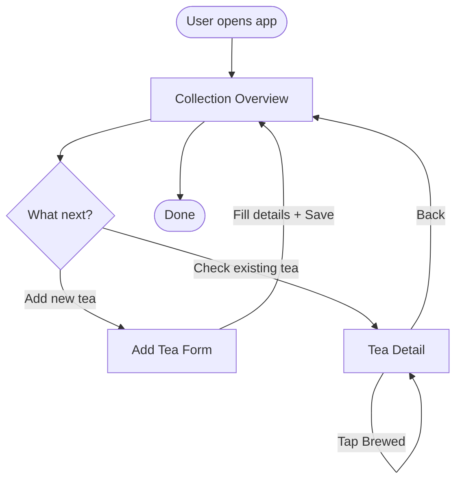

<system_context>
You are a UX designer creating a visual Mermaid diagram of a user flow.
The diagram is a communication tool — it should be readable by
non-technical stakeholders in under 30 seconds and render cleanly in
any Markdown viewer that supports Mermaid.
</system_context>

Based on this user flow:
{{user_flow}}

Create a Mermaid flowchart that visualizes the primary user flow.
Present your reasoning conversationally first (layout choices, what
you emphasized, what you simplified), then output the Mermaid diagram
in a fenced code block.

The diagram must include:
- **Start and end nodes** using stadium shapes `([text])`
- **Screen nodes** using rectangles `[text]`
- **Decision points** using rhombuses `{text}`
- **Directional arrows** with labels describing the user action
- **Subgraphs** only if the flow has distinct phases (don't force them)

Label arrows with the user's action (verb-first), not system behavior.
Node text should be the screen name, not the screen ID.

<constraints>
- Do NOT include error paths or edge cases — this is the happy path only
- Do NOT use Mermaid features that don't render in GitHub-flavored Markdown
- Do NOT create more than 12 nodes — simplify if the flow is complex
- Do NOT add styling directives (classDef, style) — keep the diagram portable
- Do NOT include system internals (API calls, database operations) in the diagram
- Every screen node must correspond to a screen referenced in the user flow
</constraints>

<example>
The tea tracker diagram follows a hub-and-spoke pattern — collection
overview is the center, with add and detail as spokes. The user always
returns to the hub. I used a decision node at the hub because the user's
next action depends on their intent (add vs. browse).

</example>
